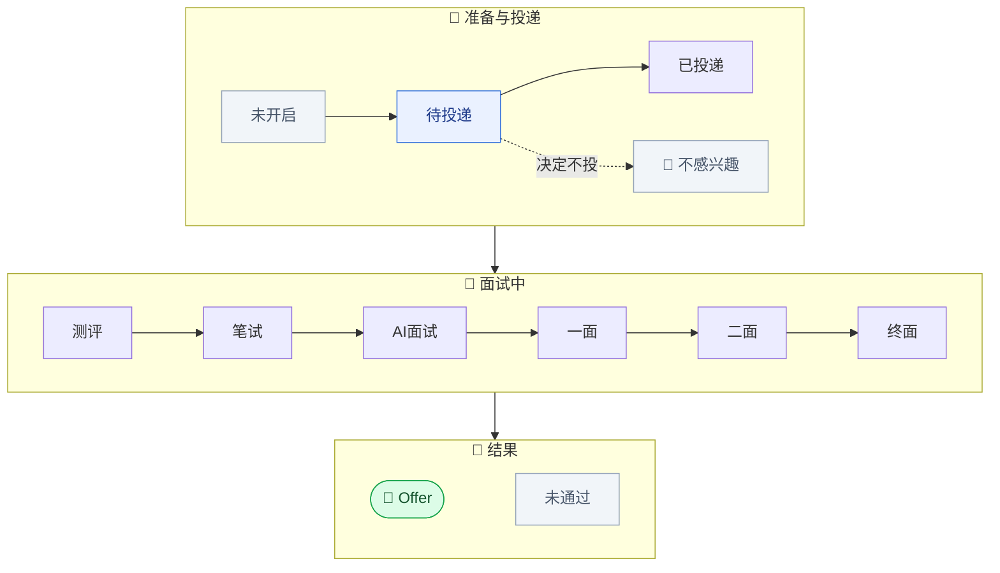
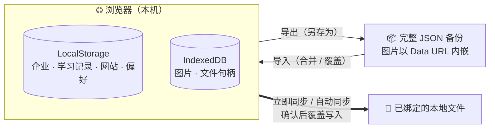

<div align="center">


<a href="#-快速开始"></a>

<p>
  <a href="https://github.com/zyj200206030712/JobAssistant/stargazers"></a>
  <a href="https://github.com/zyj200206030712/JobAssistant/network/members"></a>
  <a href="https://github.com/zyj200206030712/JobAssistant/commits/main"></a>
</p>

<p>
  
  
  
  
  
  
</p>

<p>
  <a href="#-快速开始"><b>🚀 快速开始</b></a> ·
  <a href="#-功能亮点"><b>✨ 功能亮点</b></a> ·
  <a href="#️-界面预览"><b>🖼️ 界面预览</b></a> ·
  <a href="#-数据与备份"><b>💾 数据与备份</b></a> ·
  <a href="#-常见问题"><b>❓ 常见问题</b></a> ·
  <a href="#-star-趋势"><b>📈 Star 趋势</b></a>
</p>

<br />

<a href="data/pics/%E8%81%8C%E8%B7%AF_%E9%A6%96%E9%A1%B5.png"></a>

<sub>▲ 首页「求职总览」：投递统计、已行动进度环、最近添加企业与近期待办，一眼看清整个校招季</sub>

</div>

<br />

> **职路** 是一个 **双击 `index.html` 就能用** 的个人求职工作台 —— 目标企业、投递进度、八股与刷题笔记、常用求职网站，全部收进一个页面。
>
> 没有账号，没有服务器，没有依赖。数据只保存在你自己的浏览器里，想带走时一键导出 JSON。

## 🤔 为什么做职路

校招季最累的往往不是笔试面试本身，而是 **信息管理**：

| 😵 你可能正在经历 | ✅ 职路的做法 |
| --- | --- |
| 几百家企业，官网、公众号、招聘链接散落在收藏夹和聊天记录里 | 每家企业一条记录，官网 / 招聘网址 / 岗位链接集中保存，一键在新标签页打开 |
| 投了哪家、走到哪一步、哪天截止，全靠脑子记 | 12 种投递状态覆盖从「待投递」到「Offer」全流程，首页自动统计并生成待办 |
| 想找某家企业，却记不清名字只记得一句备注 | 全字段搜索：名称、岗位、地点、备注、日期片段、网址域名都能搜到 |
| 八股、行测、申论、刷题笔记散落在不同软件 | 学习中心五大模块，卡片式记录，支持图片附件和「完成 / 复习」标记 |
| 在线工具要注册登录，求职信息不想上传 | 纯本地运行，数据存在浏览器 LocalStorage 与 IndexedDB，不经过任何服务器 |
| 担心换电脑、清缓存后数据全没了 | 完整 JSON 备份（图片一并内嵌），支持合并 / 覆盖导入，Chrome / Edge 还能绑定本地文件自动同步 |

## 🚀 快速开始

<table>
<tr>
<td width="50%" valign="top">

**方式一：Git 克隆**

```bash
git clone https://github.com/zyj200206030712/JobAssistant.git
```

然后双击 `JobAssistant/index.html`。

</td>
<td width="50%" valign="top">

**方式二：直接下载**

<a href="https://github.com/zyj200206030712/JobAssistant/archive/refs/heads/main.zip"></a>

解压后双击 `index.html`。

</td>
</tr>
</table>

**不需要** 安装 Node.js、Python 或任何运行环境，也 **不需要** 启动本地服务器。三步上手：

| 步骤 | 操作 | 位置 |
| :---: | --- | --- |
| **①** | 点击「新增企业」，只填企业名称即可保存，岗位、链接等信息随时补充 | 企业管理 |
| **②** | 投递或面试后编辑企业、更新状态，统计与待办自动刷新 | 企业管理 → 首页 |
| **③** | 点击「选择位置并导出」，保存一份完整 JSON 备份 | 设置 |

> [!IMPORTANT]
> 数据默认保存在 **当前浏览器** 中。清除浏览器站点数据、更换浏览器或配置文件、移动项目文件夹、更换电脑之前，请务必先在「设置」中 **导出 JSON 备份**。

### 浏览器支持

| 能力 | Chrome / Edge（推荐） | Firefox |
| --- | :---: | :---: |
| 企业管理、学习中心、相关网站、深浅主题等核心功能 | ✅ | ✅ |
| 导出完整 JSON 备份 | ✅ 弹出「另存为」自选位置 | ✅ 下载到默认目录 |
| 导入 JSON（合并 / 覆盖） | ✅ | ✅ |
| 绑定本地文件 + 修改后自动同步 | ✅ | ❌ 页面会提示改用导出 |

## ✨ 功能亮点

<table>
<tr>
<td width="33%" valign="top">

### 📊 求职总览
企业总数、已投递、待投递、面试中、Offer 五项统计，配合「已行动」进度环；近期截止、待投递、面试准备自动汇总成待办。

</td>
<td width="33%" valign="top">

### 🏢 企业管理
央国企 / 研究所 / 私企 / 外企四类分组，按批次、状态、关键词筛选；左侧紧凑列表 + 右侧完整详情栏，支持键盘选择。

</td>
<td width="33%" valign="top">

### 📚 学习中心
项目及八股、央国企行测、贵州选调申论、LeetCode、模拟面试五大模块，卡片记录、大图详情、随机抽题。

</td>
</tr>
<tr>
<td width="33%" valign="top">

### 🔗 相关网站
求职平台、官方渠道、企业官网、常用工具统一收藏，分类筛选、搜索，一键新标签页访问。

</td>
<td width="33%" valign="top">

### 🖼️ 图片附件
所有学习记录均可粘贴、拖入或选择图片，自动压缩；详情页带画廊与大图预览，支持 `Esc` 和 `←` / `→` 切换。

</td>
<td width="33%" valign="top">

### 💾 备份与同步
完整 JSON 导出 / 导入，图片随备份内嵌；「绑定」「导入」「同步」三种语义严格分离，覆盖操作一律二次确认。

</td>
</tr>
</table>

<details>
<summary><b>🏢 企业管理 · 完整功能清单</b></summary>

<br />

- **只有企业名称必填**，其余字段随时补充：分类、企业信息来源 / 官网、招聘网址、地点、企业备注、岗位、方向、批次、状态、投递日期、截止日期、岗位 / 投递状态链接、投递备注
- **分类 Tab**：`央国企` · `研究所` · `私企` · `外企`，每个分类显示企业数量
- **筛选**：招聘批次（提前批 / 正式批 / 补录）、投递状态，一键重置
- **全字段搜索**：中英文包含匹配、大小写不敏感，支持日期片段和网址域名
- **紧凑列表**：六列布局，岗位下方显示地点、状态下方显示批次，备注列最多显示三行并保留换行，悬停查看全文
- **详情栏**：点击或用键盘选中企业后，右侧展示全部字段并高亮当前行；窄屏时详情栏移到列表上方
- **智能跳转**：「打开招聘链接」按 岗位链接 → 招聘网址 → 官网 的优先级打开
- **日期校验**：原生日期框、年份限定四位、截止日期不得早于投递日期
- **最近修改时间**：每次新增或编辑自动更新，列表按最近更新排序
- **安全删除**：删除企业必须二次确认；截止日期过去后 **不会** 删除或隐藏任何企业和链接

</details>

<details>
<summary><b>📚 学习中心 · 完整功能清单</b></summary>

<br />

| 模块 | 记录内容 | 特色 |
| --- | --- | --- |
| 💼 我的项目及八股 | **项目**：名称、时间、简介、技术栈、主要工作、困难及解决、成果、面试讲解<br />**八股**：面试问题、标准答案、追问、备注 | 长答案输入框，可自由拉伸 |
| 📝 央国企行测 | 题目、题型（言语理解 / 判断推理 / 数量关系 / 资料分析 / 常识）、答案、解析、错题原因 | 收藏与错题标记，答案框独占整行 |
| ✍️ 贵州选调申论 | 标题、主题分类、内容、金句、案例、备注 | 按主题积累写作素材 |
| 🧮 LeetCode 算法 | 名称、题目详情（必填）、题号、链接、难度、类型、解题思路、Python 代码、时间 / 空间复杂度 | 「完成」「复习」标记，按难度筛选 |
| 🎤 模拟面试 | 面试问题、回答 | 随机抽题练习 |

- 所有卡片右上角都有 **遇到次数** 计数器（`-1` / `+1`），标记高频题
- 所有卡片均可点击打开大尺寸详情，操作按钮不会误触
- 图片附件：支持 PNG / JPEG / WebP，单张原图 ≤ 10 MB，每条记录最多 20 张，最长边自动压缩到 1920 px
- 大图预览完整显示横图、竖图和方图，支持遮罩关闭、`Esc`、上一张 / 下一张

</details>

## 🖼️ 界面预览

<table>
<tr>
<td width="50%" align="center">
<b>🏢 企业管理</b><br />
<sub>分类 Tab · 批次与状态筛选 · 右侧完整详情栏</sub><br /><br />
<a href="data/pics/%E8%81%8C%E8%B7%AF_%E4%BC%81%E4%B8%9A%E7%AE%A1%E7%90%86.png"></a>
</td>
<td width="50%" align="center">
<b>📚 学习中心</b><br />
<sub>五大模块 · 卡片记录 · 完成与复习标记</sub><br /><br />
<a href="data/pics/%E8%81%8C%E8%B7%AF_%E5%AD%A6%E4%B9%A0%E4%B8%AD%E5%BF%83.png"></a>
</td>
</tr>
<tr>
<td width="50%" align="center">
<b>🔗 相关网站</b><br />
<sub>分类统计 · 搜索筛选 · 一键访问</sub><br /><br />
<a href="data/pics/%E8%81%8C%E8%B7%AF_%E7%BD%91%E7%AB%99.png"></a>
</td>
<td width="50%" align="center">
<b>⚙️ 设置</b><br />
<sub>深浅主题 · 存储统计 · JSON 备份与本地同步</sub><br /><br />
<a href="data/pics/%E8%81%8C%E8%B7%AF_%E8%AE%BE%E7%BD%AE.png"></a>
</td>
</tr>
</table>

<p align="center"><sub>点击任意截图查看原图</sub></p>

## 🔄 投递流程与自动统计

职路把每家企业的投递状态串成一条清晰的流水线，首页数据全部 **根据企业记录实时计算**，无需手动维护：



| 首页指标 | 统计口径 |
| --- | --- |
| 企业总数 | 全部企业记录 |
| 已投递 / 待投递 / Offer | 状态分别为「已投递」「待投递」「Offer」 |
| 面试中 | 测评、笔试、AI面试、一面、二面、终面 |
| 已行动进度环 | 已投递及之后的状态（含 Offer、未通过）占企业总数的比例 |

**近期待办** 自动生成规则：

- 📅 **截止提醒**：截止日期在 30 天内的企业（Offer、未通过、不感兴趣除外），7 天内高亮为红色
- 📮 **投递提醒**：状态为「待投递」的企业
- 📖 **准备提醒**：处于测评、笔试、AI面试或各轮面试中的企业

> [!TIP]
> 「不感兴趣」用来保留已经了解过、但明确不投递的企业：可以搜索和筛选，但不计入已行动进度，也不会生成任何待办。

## 💾 数据与备份

职路没有后端，所有数据都在你自己的浏览器里：



三个容易混淆的操作，职路做了 **严格区分**：

| 操作 | 方向 | 会发生什么 |
| --- | :---: | --- |
| **绑定本地备份文件** | — | 只记录文件位置，**不读取、不写入** 文件内容 |
| **导入 JSON 数据** | 文件 → 网页 | 选择或拖入备份文件，按「合并现有数据」或「覆盖对应数据」恢复 |
| **立即同步（写入文件）** | 网页 → 文件 | 确认后用当前数据 **覆盖** 绑定文件；开启「修改后自动同步」同样需要确认 |

<details>
<summary><b>📖 本地文件自动同步：详细步骤（Chrome / Edge）</b></summary>

<br />

1. 先在「设置」导出一份备份，再点击「绑定本地备份文件」选择这份文件。
2. 点击「立即同步（写入文件）」并确认，把网页当前数据写入绑定文件；也可以确认开启「修改后自动同步」。
3. 重新打开页面后如果提示权限失效，点击「立即同步」重新授权即可，无需重新绑定；同步失败时仍可手动导出备份。

- 重新绑定后，自动同步默认关闭
- 解除绑定不会删除磁盘上的文件
- 从文件恢复数据请使用「导入 JSON 数据」，绑定和同步都不会读取文件

</details>

<details>
<summary><b>🗂️ 运行时存储位置（开发者参考）</b></summary>

<br />

| 数据 | 位置 |
| --- | --- |
| 企业 | `localStorage` → `jobAssistant.companies` |
| 学习资料 | `localStorage` → `jobAssistant.learning` |
| 相关网站 | `localStorage` → `jobAssistant.websites` |
| 主题与同步偏好 | 其他 `jobAssistant.*` 键 |
| 图片二进制 | IndexedDB `JobAssistantMedia` → `images` |
| 本地同步文件句柄 | IndexedDB `JobAssistantMedia` → `fileHandles` |

`data/*.json` 只是初始 / 示例数据，**不是** 浏览器运行时的实时数据文件。

</details>

## 📁 项目结构

```text
JobAssistant/
├── index.html           # 页面入口，双击打开
├── style.css            # 界面样式，含深色模式
├── script.js            # 全部功能逻辑
├── data/
│   ├── companies.json   # 初始企业数据（非实时数据）
│   ├── learning.json    # 初始学习资料
│   ├── websites.json    # 初始相关网站
│   ├── quicklinks.json  # 旧版常用链接（仅用于兼容迁移）
│   └── pics/            # README 截图
├── assets/icons/        # 图标资源
├── PROJECT_HANDOFF.md   # 开发与维护交接文档
└── README.md
```

## 🧭 设计原则

- **零依赖**：只用 HTML、CSS、原生 JavaScript 和 JSON，不引入框架、构建工具、后端或数据库
- **离线优先**：双击即可运行，不需要安装环境、启动服务或联网
- **数据安全**：删除需确认、覆盖需确认；截止日期过期永远不会触发自动删除；绑定、导入、同步语义分离
- **向后兼容**：旧版「研究所/央国企」分类自动拆分迁移，旧备份中的常用链接自动转为「工具」类网站

## ❓ 常见问题

<details>
<summary><b>我的数据到底存在哪里？会被上传吗？</b></summary>

<br />

数据保存在当前浏览器的 LocalStorage 和 IndexedDB 中，职路没有任何服务器，也不会上传数据。导入 JSON 时文件同样只在本机浏览器中处理。

</details>

<details>
<summary><b>怎么把数据迁移到另一台电脑？</b></summary>

<br />

在旧电脑的「设置」中点击「选择位置并导出」得到完整 JSON（图片已内嵌），拷到新电脑后打开职路，在「导入 JSON 数据」区域选择该文件，按需选择「合并」或「覆盖」即可。

</details>

<details>
<summary><b>重新打开页面后数据不见了？</b></summary>

<br />

通常是浏览器存储环境变了：清除了「Cookie 和其他站点数据」、使用了无痕 / InPrivate 窗口、切换了浏览器或配置文件，或者移动了项目文件夹。用之前导出的 JSON 备份导入即可恢复，这也是建议定期导出的原因。

</details>

<details>
<summary><b>绑定了备份文件，为什么数据没有恢复？</b></summary>

<br />

这是有意为之的设计：绑定只记录文件位置，不会读取文件。恢复数据请使用「导入 JSON 数据」。

</details>

<details>
<summary><b>设置里显示「当前浏览器不支持文件同步」？</b></summary>

<br />

本地文件同步依赖 Chrome / Edge 提供的文件系统访问能力。其他浏览器可以正常使用全部核心功能，备份请使用「导出 JSON」。

</details>

<details>
<summary><b>分类、状态、学习模块能改成适合我的吗？</b></summary>

<br />

可以直接修改源码。建议先阅读 [PROJECT_HANDOFF.md](PROJECT_HANDOFF.md)，里面整理了数据结构、关键函数入口和必须保持的兼容规则。

</details>

## 🤝 参与贡献

欢迎通过 [Issue](https://github.com/zyj200206030712/JobAssistant/issues) 反馈问题、提出建议，或直接提交 Pull Request。动手之前请留意：

- 保持 **纯 HTML / CSS / 原生 JavaScript / JSON**，不引入框架和构建步骤
- 新增字段需提供默认值或迁移逻辑，保证旧数据和旧备份仍能导入
- 开发期可以用 `node --check script.js` 做语法检查，但项目运行不能依赖 Node.js
- **不要提交个人备份文件** `JobAssistant-backup*.json`（已在 `.gitignore` 中忽略）

## 📈 Star 趋势

## Star History

<a href="https://www.star-history.com/?repos=zyj200206030712%2FJobAssistant&type=date&legend=top-left">
 <picture>
   <source media="(prefers-color-scheme: dark)" srcset="https://api.star-history.com/chart?repos=zyj200206030712/JobAssistant&type=date&theme=dark&legend=top-left" />
   <source media="(prefers-color-scheme: light)" srcset="https://api.star-history.com/chart?repos=zyj200206030712/JobAssistant&type=date&legend=top-left" />
   
 </picture>
</a>

<div align="center">

<br />

**如果职路帮你理清了求职节奏，欢迎点一个 ⭐ Star，让更多正在找工作的同学看到它。**


</div>
