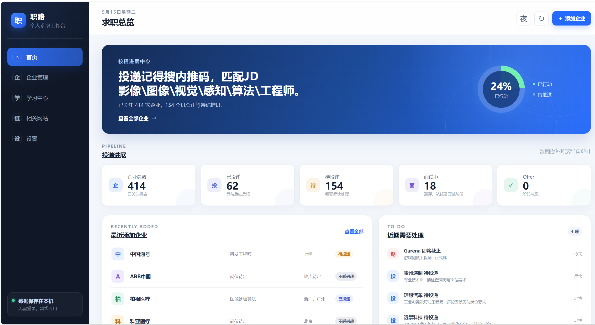
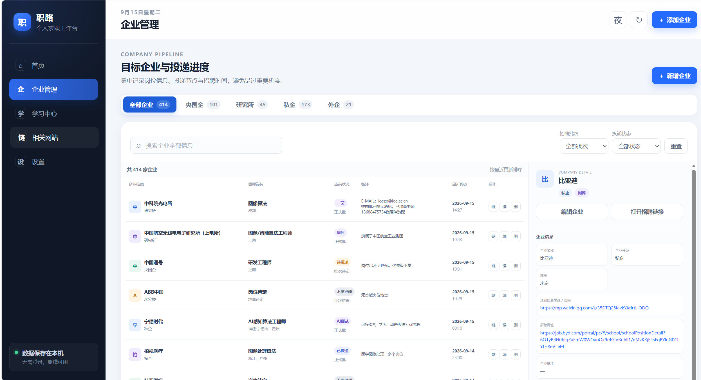
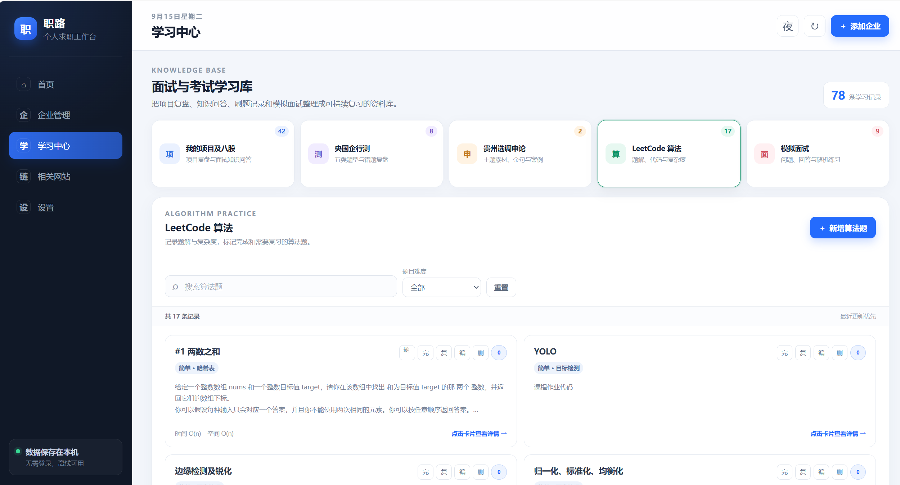
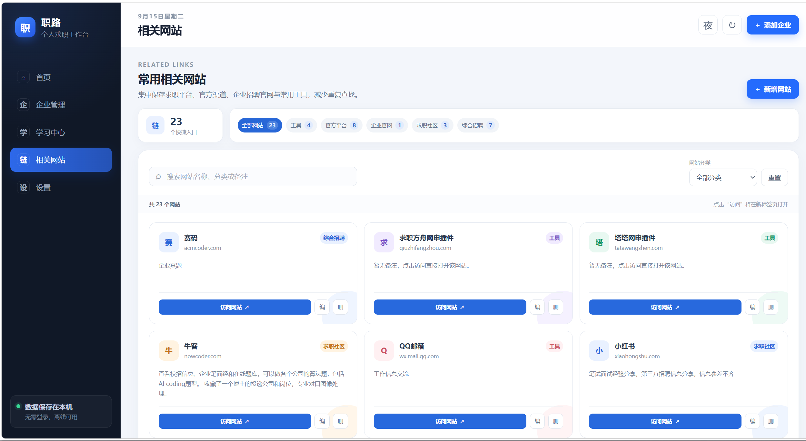
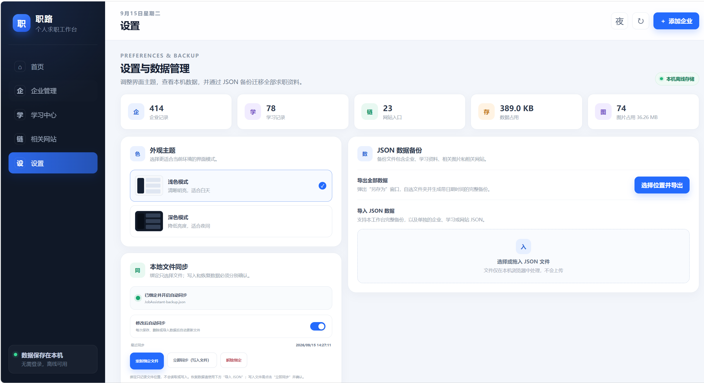

# 职路 · 个人求职工作台

在本机集中管理目标企业、投递进度、学习资料和常用求职网站，无需登录。

## 快速开始

**双击 `index.html` 即可使用，无需安装环境或启动服务器。** 推荐使用最新版 Chrome、Edge 或 Firefox；本地文件自动同步建议使用 Chrome 或 Edge。

1. **添加企业**：进入“企业管理”，点击“新增企业”，填写企业名称即可保存，岗位和招聘链接等信息可稍后补充。
2. **更新进度**：投递或面试后编辑企业，更新状态；在“首页”查看统计与近期事项。
3. **备份数据**：进入“设置”，点击“选择位置并导出”，保存完整 JSON 备份。

> 数据自动保存在当前浏览器中。清理浏览器数据、更换浏览器、移动项目文件夹或更换电脑前，请先导出备份。

## 图文使用指南

### 首页：查看求职进度

查看投递统计、最近添加企业和近期需要处理的事项，点击“查看全部企业”进入企业管理。

### 企业管理：记录企业与投递状态

点击“新增企业”记录目标企业，按分类、招聘批次、投递状态或关键词查找；点击企业行查看详情，通过编辑更新岗位、状态和备注。

### 学习中心：整理资料与复习

选择项目及八股、行测、申论、LeetCode 或模拟面试模块，新增学习记录；支持搜索、详情查看和添加图片，算法题可标记完成或需要复习。

### 相关网站：收藏常用入口

点击“新增网站”保存网址、分类和备注，使用搜索或分类筛选查找，点击“访问网站”在新标签页打开。

### 设置：切换主题与管理备份

切换浅色或深色模式，查看本机数据和图片占用，并进行 JSON 备份、恢复或本地文件同步。

## 备份与同步

### 导出与恢复

- **导出**：在“设置”点击“选择位置并导出”，保存包含企业、学习资料、图片和网站的完整 JSON 文件。默认文件名带日期时间；不支持文件选择窗口的浏览器会下载到默认目录。
- **恢复**：在“导入 JSON 数据”区域选择或拖入备份文件，选择“合并现有数据”或“覆盖对应数据”，再确认导入。合并用于整合资料，覆盖用于替换对应类别的数据。

### 本地文件自动同步（可选）

1. 使用 Chrome 或 Edge，先导出备份，再在“设置”点击“绑定本地备份文件”选择该文件。
2. 点击“立即同步（写入文件）”并确认，将网页当前数据写入绑定文件；也可确认开启“修改后自动同步”。
3. 如果重新打开页面后提示权限失效，点击“立即同步”重新授权；同步失败时仍可手动导出备份。

**绑定只记录文件位置，不会读取或恢复数据；同步会用当前数据覆盖绑定文件。** 从文件恢复请使用“导入 JSON 数据”。重新绑定后自动同步默认关闭，解除绑定不会删除磁盘文件。

## 项目说明

| 文件 | 用途 |
| --- | --- |
| `index.html` | 页面入口，双击打开 |
| `style.css` / `script.js` | 界面样式与功能逻辑 |
| `data/` | 初始数据与 README 截图；其中 JSON 文件不是实时数据 |
| `assets/icons/` | 图标资源 |

实际使用数据保存在当前浏览器的 LocalStorage 和 IndexedDB 中，图片随完整 JSON 备份一起导出。开发与维护说明见 [PROJECT_HANDOFF.md](PROJECT_HANDOFF.md)。
