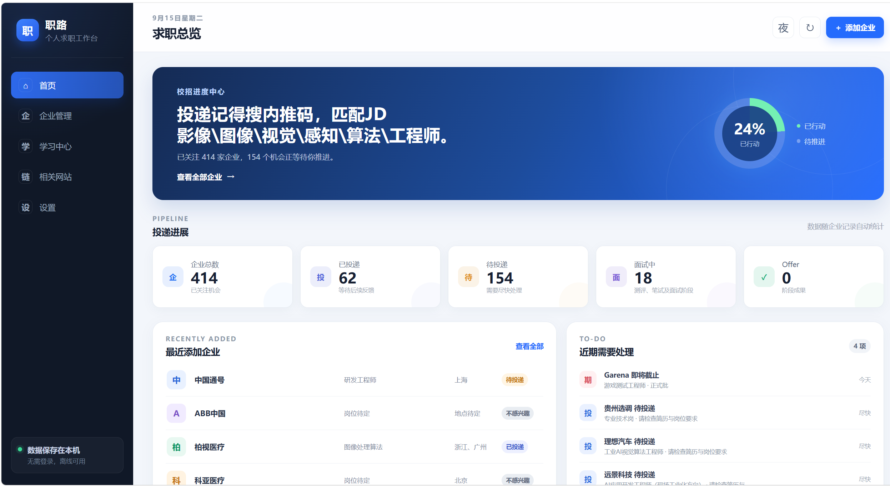
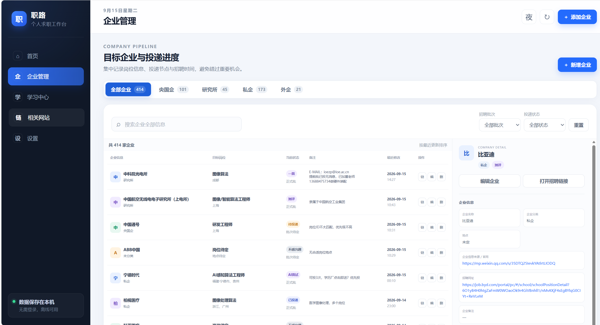
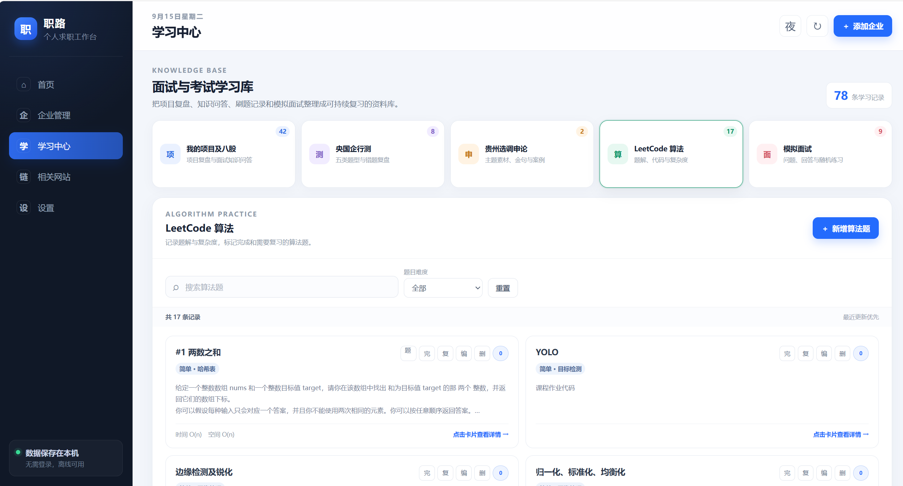
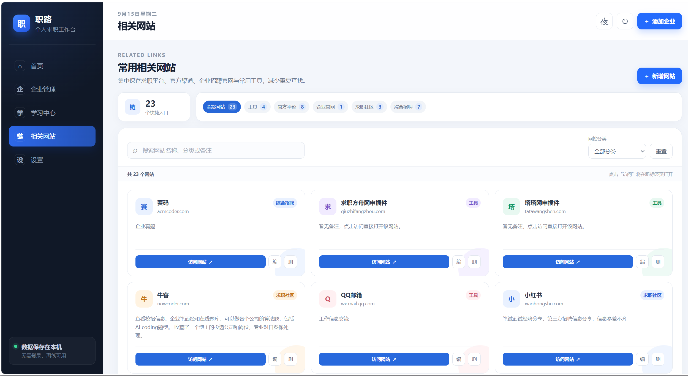
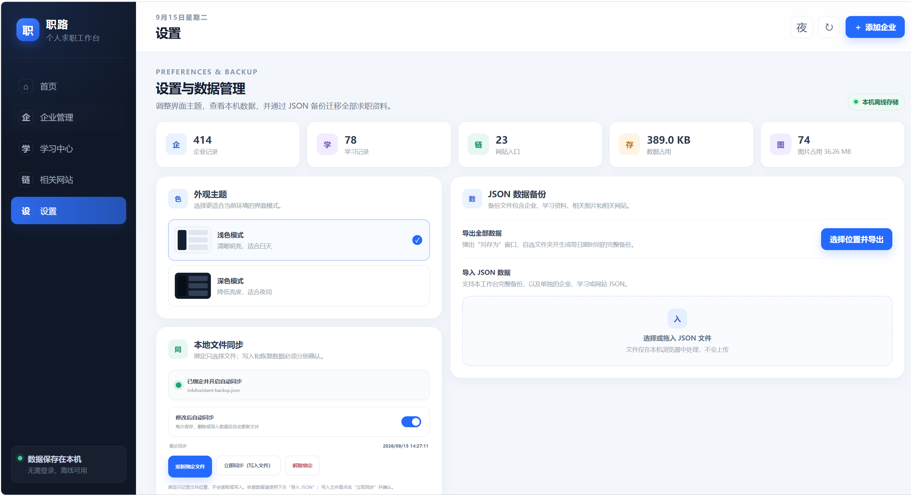

# 职路 · 个人求职工作台

在本机集中管理目标企业、投递进度、学习资料和常用求职网站，无需登录。

## 快速开始

**双击 `index.html` 即可使用，无需安装环境或启动服务器。** 推荐使用最新版 Chrome、Edge 或 Firefox；本地文件自动同步建议使用 Chrome 或 Edge。

1. **添加企业**：进入“企业管理”，点击“新增企业”，填写企业名称即可保存，岗位和招聘链接等信息可稍后补充。
2. **更新进度**：投递或面试后编辑企业，更新状态；在“首页”查看统计与近期事项。
3. **备份数据**：进入“设置”，点击“选择位置并导出”，保存完整 JSON 备份。

> 数据自动保存在当前浏览器中。清理浏览器数据、更换浏览器、移动项目文件夹或更换电脑前，请先导出备份。

## 图文使用指南

### 首页：查看求职进度

查看投递统计、最近添加企业和近期需要处理的事项，点击“查看全部企业”进入企业管理。



### 企业管理：记录企业与投递状态

点击“新增企业”记录目标企业，按分类、招聘批次、投递状态或关键词查找；点击企业行查看详情，通过编辑更新岗位、状态和备注。



### 学习中心：整理资料与复习

选择项目及八股、行测、申论、LeetCode 或模拟面试模块，新增学习记录；支持搜索、详情查看和添加图片，算法题可标记完成或需要复习。



### 相关网站：收藏常用入口

点击“新增网站”保存网址、分类和备注，使用搜索或分类筛选查找，点击“访问网站”在新标签页打开。



### 设置：切换主题与管理备份

切换浅色或深色模式，查看本机数据和图片占用，并进行 JSON 备份、恢复或本地文件同步。



## 备份与同步

### 导出与恢复

- **导出**：在“设置”点击“选择位置并导出”，保存包含企业、学习资料、图片和网站的完整 JSON 文件。默认文件名带日期时间；不支持文件选择窗口的浏览器会下载到默认目录。
- **恢复**：在“导入 JSON 数据”区域选择或拖入备份文件，选择“合并现有数据”或“覆盖对应数据”，再确认导入。合并用于整合资料，覆盖用于替换对应类别的数据。

### 本地文件自动同步（可选）

1. 使用 Chrome 或 Edge，先导出备份，再在“设置”点击“绑定本地备份文件”选择该文件。
2. 点击“立即同步（写入文件）”并确认，将网页当前数据写入绑定文件；也可确认开启“修改后自动同步”。
3. 如果重新打开页面后提示权限失效，点击“立即同步”重新授权；同步失败时仍可手动导出备份。

**绑定只记录文件位置，不会读取或恢复数据；同步会用当前数据覆盖绑定文件。** 从文件恢复请使用“导入 JSON 数据”。重新绑定后自动同步默认关闭，解除绑定不会删除磁盘文件。

## 项目说明

| 文件 | 用途 |
| --- | --- |
| 企业 | `localStorage` → `jobAssistant.companies` |
| 学习资料 | `localStorage` → `jobAssistant.learning` |
| 相关网站 | `localStorage` → `jobAssistant.websites` |
| 主题与同步偏好 | 其他 `jobAssistant.*` 键 |
| 图片二进制 | IndexedDB `JobAssistantMedia` → `images` |
| 本地同步文件句柄 | IndexedDB `JobAssistantMedia` → `fileHandles` |

`data/*.json` 只是初始 / 示例数据，**不是** 浏览器运行时的实时数据文件。

</details>

## 📁 项目结构

```text
JobAssistant/
├── index.html           # 页面入口，双击打开
├── style.css            # 界面样式，含深色模式
├── script.js            # 全部功能逻辑
├── data/
│   ├── companies.json   # 初始企业数据（非实时数据）
│   ├── learning.json    # 初始学习资料
│   ├── websites.json    # 初始相关网站
│   ├── quicklinks.json  # 旧版常用链接（仅用于兼容迁移）
│   └── pics/            # README 截图
├── assets/icons/        # 图标资源
├── PROJECT_HANDOFF.md   # 开发与维护交接文档
└── README.md
```

## 🧭 设计原则

- **零依赖**：只用 HTML、CSS、原生 JavaScript 和 JSON，不引入框架、构建工具、后端或数据库
- **离线优先**：双击即可运行，不需要安装环境、启动服务或联网
- **数据安全**：删除需确认、覆盖需确认；截止日期过期永远不会触发自动删除；绑定、导入、同步语义分离
- **向后兼容**：旧版「研究所/央国企」分类自动拆分迁移，旧备份中的常用链接自动转为「工具」类网站

## ❓ 常见问题

<details>
<summary><b>我的数据到底存在哪里？会被上传吗？</b></summary>

<br />

数据保存在当前浏览器的 LocalStorage 和 IndexedDB 中，职路没有任何服务器，也不会上传数据。导入 JSON 时文件同样只在本机浏览器中处理。

</details>

<details>
<summary><b>怎么把数据迁移到另一台电脑？</b></summary>

<br />

在旧电脑的「设置」中点击「选择位置并导出」得到完整 JSON（图片已内嵌），拷到新电脑后打开职路，在「导入 JSON 数据」区域选择该文件，按需选择「合并」或「覆盖」即可。

</details>

<details>
<summary><b>重新打开页面后数据不见了？</b></summary>

<br />

通常是浏览器存储环境变了：清除了「Cookie 和其他站点数据」、使用了无痕 / InPrivate 窗口、切换了浏览器或配置文件，或者移动了项目文件夹。用之前导出的 JSON 备份导入即可恢复，这也是建议定期导出的原因。

</details>

<details>
<summary><b>绑定了备份文件，为什么数据没有恢复？</b></summary>

<br />

这是有意为之的设计：绑定只记录文件位置，不会读取文件。恢复数据请使用「导入 JSON 数据」。

</details>

<details>
<summary><b>设置里显示「当前浏览器不支持文件同步」？</b></summary>

<br />

本地文件同步依赖 Chrome / Edge 提供的文件系统访问能力。其他浏览器可以正常使用全部核心功能，备份请使用「导出 JSON」。

</details>

<details>
<summary><b>分类、状态、学习模块能改成适合我的吗？</b></summary>

<br />

可以直接修改源码。建议先阅读 [PROJECT_HANDOFF.md](PROJECT_HANDOFF.md)，里面整理了数据结构、关键函数入口和必须保持的兼容规则。

</details>

## 🤝 参与贡献

欢迎通过 [Issue](https://github.com/zyj200206030712/JobAssistant/issues) 反馈问题、提出建议，或直接提交 Pull Request。动手之前请留意：

- 保持 **纯 HTML / CSS / 原生 JavaScript / JSON**，不引入框架和构建步骤
- 新增字段需提供默认值或迁移逻辑，保证旧数据和旧备份仍能导入
- 开发期可以用 `node --check script.js` 做语法检查，但项目运行不能依赖 Node.js
- **不要提交个人备份文件** `JobAssistant-backup*.json`（已在 `.gitignore` 中忽略）

## 📈 Star 趋势

## Star History

<a href="https://www.star-history.com/?repos=zyj200206030712%2FJobAssistant&type=date&legend=top-left">
 <picture>
   <source media="(prefers-color-scheme: dark)" srcset="https://api.star-history.com/chart?repos=zyj200206030712/JobAssistant&type=date&theme=dark&legend=top-left" />
   <source media="(prefers-color-scheme: light)" srcset="https://api.star-history.com/chart?repos=zyj200206030712/JobAssistant&type=date&legend=top-left" />
   
 </picture>
</a>

<div align="center">

<br />

**如果职路帮你理清了求职节奏，欢迎点一个 ⭐ Star，让更多正在找工作的同学看到它。**


</div>
